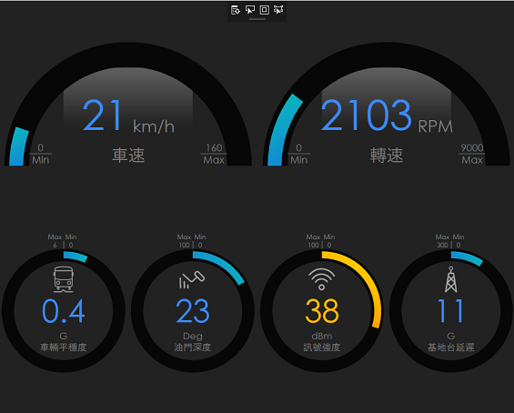
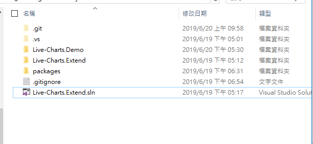
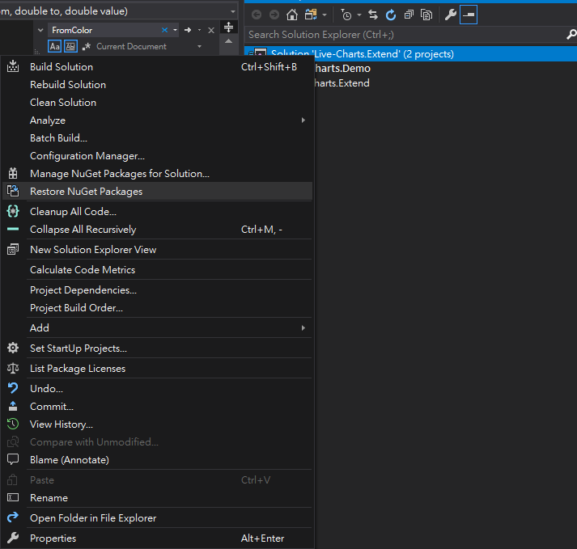
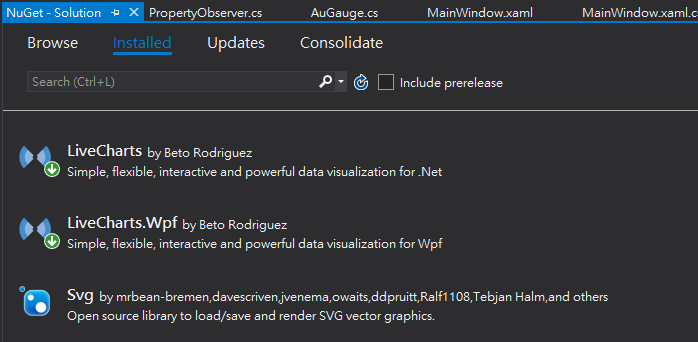
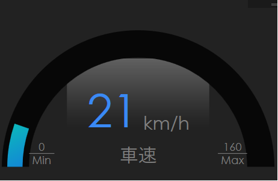
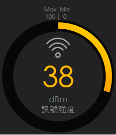

# Live-Charts.Extend

## 1.Introduction
Live-Charts.Extend is a extended Gauge Chart Lib for [Live-Charts](https://lvcharts.net/). 


## 2.Purpose
The native Gauge chart of Live-charts is too simple, and it can't satisfy our needs. So, I build a new one to improve it. And it also has all the advantages of native Gauge charts.


With the samples above, you could see the advantages of Live-charts is still exist. For example, RotateTransform、Uses360Mode 、GaugeActiveFill ..etc

## 3.Environment & Installation
Language： C#/Xaml

Framework：.Net Framework 4.6.1 above. 

IDE：Visual Studio 2015 above. 

Github Source Code：https://github.com/npkalala/Live-Charts.Extend.git

Installation：
- 1 Open `Live-Charts.Extend.sln`.


- 2 Restore Nuget Package


- 3 Compile the project **Live-Charts.Extend**

- 4 Open target project and import`Live-Charts.Extend.dll` into it. Then install related Live-chart Lib in Nuget as following


## 4.Attributes

The description of the Attributes.

|Attribute|Description|Remark|
|:-|:-|:-|
|From|The minimal value of Gauge|
|To|The maximal value of Gauge|
|Value|The current value of Gauge.| You can binding the value with gauge
|LabelsVisibility|Set the visibility of Label|Visible/Hidden/Collapse
|GaugeBackground|Set the background of gauge||
|Foreground|Set the forground of Title|
|GaugeTitle| Set the title label|
|GaugeUnit|Set the unit label|
|Uses360Mode|Set gauge as full circle|True/False
|IconSource|Set the image of full circle gauge|source:ImageSource

## 5.Sample
- Step 1. Import Lib
```xml
<Window x:Class="Live_Charts.Demo.MainWindow"
        xmlns="http://schemas.microsoft.com/winfx/2006/xaml/presentation"
        xmlns:x="http://schemas.microsoft.com/winfx/2006/xaml"
        xmlns:d="http://schemas.microsoft.com/expression/blend/2008"
        xmlns:mc="http://schemas.openxmlformats.org/markup-compatibility/2006"
        xmlns:local="clr-namespace:Live_Charts.Demo"
        xmlns:chart="clr-namespace:Live_Charts.Extend;assembly=Live-Charts.Extend"   <-- import Lib
        mc:Ignorable="d"
        Title="MainWindow" Height="450" Width="800">
```

- Step 2. Insert AuGaugae into you xaml
### Sample 1. Half Circle
```xml
<chart:AuGauge Margin="10" From="0" To="160" Value="21" LabelsVisibility="Visible"
    GaugeBackground="#070707" Foreground="Red"
    GaugeTitle="Speed" GaugeUnit="km/h" >
    <chart:AuGauge.GaugeActiveFill>
		<LinearGradientBrush>
			<GradientStop Color="#0BBBBA" Offset="0.0" />
			<GradientStop Color="#F50606" Offset="1.0" />
		</LinearGradientBrush>
    </chart:AuGauge.GaugeActiveFill>
</chart:AuGauge>
```

### Sample 2. Full Circle
```xml
<chart:AuGauge Margin="5"
    Uses360Mode="True"
    From="0" To="100" Value="{Binding V5}" GaugeBackground="#070707"
    Foreground="blue"
    GaugeTitle="訊號強度" GaugeUnit="dBm" IconSource="{Binding IconSignal, ElementName=BusGauge}" >
        <chart:AuGauge.GaugeRenderTransform>
            <TransformGroup>
                <RotateTransform Angle="90"></RotateTransform>
                <ScaleTransform ScaleX="1"></ScaleTransform>
            </TransformGroup>
        </chart:AuGauge.GaugeRenderTransform>
        <chart:AuGauge.GaugeActiveFill>
            <LinearGradientBrush>
                <GradientStop Color="#0BBBBA" Offset="0.0" />
                <GradientStop Color="#F50606" Offset="1.0" />
            </LinearGradientBrush>
        </chart:AuGauge.GaugeActiveFill>
</chart:AuGauge>
```
